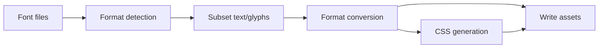

# Architecture

fontmin-rs is a Rust workspace with Node.js packaging. The goal is to keep expensive font parsing, subsetting, and conversion logic in Rust while exposing npm packages and TypeScript types for frontend ecosystems.

## Directory Structure

| Path                      | Description                                          |
| ------------------------- | ---------------------------------------------------- |
| `crates/fontmin_core`     | Core models for font assets, formats, metadata, text |
| `crates/fontmin_subset`   | TTF subsetting logic                                 |
| `crates/fontmin_woff`     | WOFF encoding and decoding                           |
| `crates/fontmin_woff2`    | WOFF2 encoding, validation, and metadata inspection  |
| `crates/fontmin_eot`      | EOT encoding and decoding                            |
| `crates/fontmin_svg`      | SVG font and SVG iconfont conversion                 |
| `crates/fontmin_config`   | JSON/JSONC configuration model used by the Rust CLI  |
| `crates/fontmin_fs`       | Shared filesystem helpers for path and glob handling |
| `crates/fontmin_pipeline` | Rust pipeline engine                                 |
| `crates/fontmin_testing`  | Shared Rust test fixtures and fixture constructors   |
| `apps/fontmin`            | Rust CLI application                                 |
| `napi/fontmin`            | N-API native binding                                 |
| `packages/fontmin`        | TypeScript package published to npm                  |
| `npm/*`                   | Platform-specific native binding package manifests   |
| `fixtures`                | Test fonts and fixed inputs                          |
| `docs`                    | VitePress documentation site                         |

## Data Flow

The CLI, Node API, and tests validate behavior around the same fixture set. In the TypeScript package, `optimize(config)` loads input files as assets, runs transforms in plugin order, then writes the final assets to `outDir`.

## Package Boundaries

Rust crates stay focused: format detection, filesystem expansion, subsetting, conversion, diagnostics, and the pipeline live in separate crates. Shared test fixtures live in `fontmin_testing`, which is used only as a dev-dependency. This lets the CLI, N-API binding, and future wasm fallback reuse the same core capabilities while keeping test data consistent.

The TypeScript package is responsible for:

- Exposing public types.
- Loading configuration files.
- Expanding input files.
- Orchestrating plugins.
- Managing cache.
- Providing the Fontmin-compatible migration layer.

## Current Limitations

- OTF metadata inspection is supported. `otf2ttf` converts static CFF OTF fonts and default/explicit CFF2 instances to static TrueType `glyf` fonts, and rewrites glyf-backed OTF wrappers. The output drops CFF2 and variation tables.
- WOFF2 inspect/validate checks headers and table directories, reads sfnt metadata tables, and supports WOFF2-to-TTF decode through the native path.
- `modernWeb()` only outputs WOFF, WOFF2, and CSS; EOT and SVG require explicit plugins or CLI formats.
- The Rust CLI currently loads JSON/JSONC config only; the TypeScript API can load TS/MJS/CJS config.
