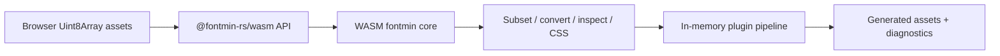

# Browser WASM Runtime Design

## Goal

Ship a browser-capable `@fontmin-rs/wasm` package that performs the same
in-memory font transformations as the native runtime. A browser application
must be able to subset a TTF, create WOFF and WOFF2 assets, generate CSS, and
run the built-in plugin pipeline without installing or loading a native Node
module. The browser runtime is part of the v0.1 release-acceptance gate.

## Scope

### Supported browser transformations

The WASM runtime supports the existing transformation set when its source
format and options are supported by the underlying Rust crates:

- TTF subsetting;
- TTF <-> WOFF and TTF <-> WOFF2;
- TTF <-> EOT;
- TTF <-> SVG font, SVG font -> TTF, and SVG icons -> TTF;
- static CFF/CFF2 OTF -> static TTF, including explicit variation coordinates;
- font metadata inspection and CSS generation.

It provides the built-in `glyph`, `ttf2woff`, `ttf2woff2`, `ttf2eot`,
`ttf2svg`, `svg2ttf`, `svgs2ttf`, `otf2ttf`, and `css` plugin transforms in an
in-memory pipeline.

### Browser boundary

Browser APIs accept `Uint8Array`, strings, and explicit asset objects. They do
not accept filesystem paths, glob patterns, CLI arguments, Node cache
directories, or Node filesystem hooks. Custom JavaScript plugins receive
assets, `emit`, and diagnostics only; filesystem helpers are unavailable.

The native `fontmin-rs` package retains its synchronous Node APIs and native
binding preference. Browser callers use an asynchronous package boundary:

```ts
import { initWasm, optimizeBrowser } from '@fontmin-rs/wasm'

await initWasm()
const result = await optimizeBrowser({
  assets: [{ fileName: 'Roboto.ttf', contents: ttfBytes }],
  plugins: [glyph({ text: 'Hello' }), ttf2woff2(), css({ fontFamily: 'Roboto' })],
})
```

`optimizeBrowser()` returns generated assets rather than writing files. The
existing `fallback: 'wasm'` option becomes available only after `initWasm()`;
calling it before initialization reports a deterministic initialization error.

## Architecture

### Packages and crates

Add `wasm/fontmin` as a pnpm workspace package and `wasm/fontmin-core` as a
separate Rust WASM crate. The WASM crate depends on shared transformation
crates rather than N-API code. It exposes a narrow `wasm-bindgen` boundary for
byte buffers, structured options, metadata, and in-memory assets.

The JavaScript package owns asynchronous module initialization, option
validation, plugin construction, and conversions between JavaScript assets and
the WASM boundary. It must expose ESM browser exports and include the `.wasm`
binary as a package asset.

Shared Rust code remains the source of truth for transformation behavior. If a
current dependency cannot compile for `wasm32-unknown-unknown`, isolate it
behind an internal codec trait and add a WASM-compatible implementation. No
browser transformation may silently fall back to a remote service or native
module.

### Data flow



Node uses its current N-API boundary. The browser package does not import
`@fontmin-rs/binding`, `node:fs`, or Node built-ins in its browser export
graph.

## Error handling

- Invalid source data and invalid options preserve the existing typed error
  categories and messages where practical.
- Unsupported formats or font features fail explicitly and name the operation.
- WASM initialization, instantiation, or codec availability failures identify
  the browser runtime and do not attempt a native fallback.
- A failed transform emits no partial asset; a failed pipeline returns the
  failing diagnostic together with no successful output for that transform.

## Compatibility and packaging

- `fontmin-rs` keeps native synchronous functions for Node compatibility.
- `@fontmin-rs/wasm` is the explicit browser entry point; it does not pretend
  to be a drop-in synchronous replacement.
- The main package may later expose a conditional browser export only after
  bundler compatibility is proven. That optimization is not required for
  v0.1.
- Release artifacts include the WASM package, generated bindings, and source
  maps only when they are part of the supported package build.

## Release acceptance matrix

The release gate runs the same fixed fixtures through native and WASM paths.
For each supported transform it compares the semantic contract rather than raw
bytes where encoders are nondeterministic: output magic, inspectable metadata,
glyph/subset expectations, and browser loadability.

| Area | Native baseline | Browser WASM acceptance |
| --- | --- | --- |
| TTF subset | Roboto Latin fixture | output parses, is smaller, and includes requested text |
| WOFF/WOFF2 | Roboto subset fixture | valid header, inspectable metadata, browser font load |
| CSS/pipeline | `modernWeb`-style chain | same generated asset names and usable CSS |
| OTF | static CFF and variable CFF2 fixtures | static TTF result and selected coordinates reflected in metadata/metrics |
| EOT/SVG/iconfont | existing fixtures | output round-trips or parses through the existing public contract |
| Invalid input | malformed/truncated inputs | matching typed diagnostic class, no output asset |

Chromium, Firefox, and WebKit run an ESM-bundled browser test that initializes
the package, performs the TTF -> subset -> WOFF2/WOFF + CSS workflow entirely
in page JavaScript, and confirms `document.fonts` loads the generated font.
Node integration tests continue to validate the native path separately.

## Non-goals

- Browser filesystem access, glob expansion, CLI commands, or disk cache.
- A remote font-conversion service.
- Preserving CFF2 variable behavior after OTF -> TTF conversion.
- Changing the existing native API to asynchronous solely for browser parity.

## Delivery stages

1. Establish the WASM package, initialization API, browser test harness, and
   an enforced release-matrix manifest.
2. Port shared TTF subset, WOFF, CSS, inspection, and in-memory pipeline
   behavior; add native-versus-WASM fixture tests.
3. Add or replace codec implementations needed for WOFF2, EOT, and SVG.
4. Port OTF conversion and variation-coordinate tests, then enforce all three
   browser engines in CI.
5. Package and publish the browser runtime with the v0.1 release candidates.

Each stage is mergeable only when its browser test first demonstrates the
required behavior, then passes alongside the native test suite.
