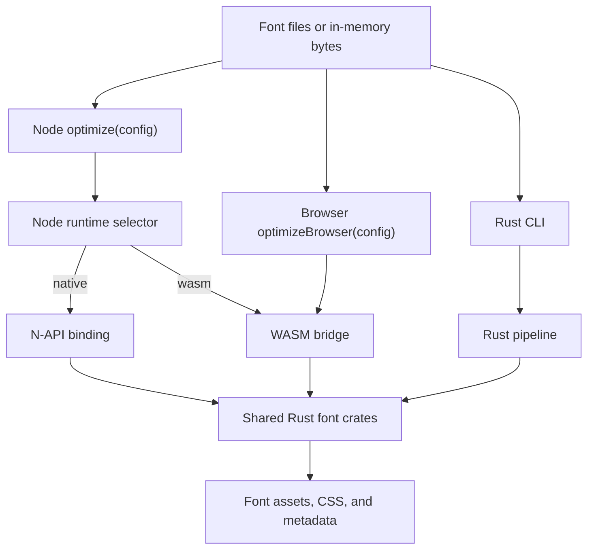

# Architecture

fontmin-rs is a Rust workspace with three public surfaces: a Rust CLI, a Node.js
package, and a browser WASM package. Font parsing, subsetting, conversion, and
CSS generation live in shared Rust crates; the JavaScript packages provide
typed runtime selection, plugin orchestration, and platform-specific I/O.

## Directory Structure

| Path                                                 | Responsibility                                                         |
| ---------------------------------------------------- | ---------------------------------------------------------------------- |
| `crates/fontmin`                                     | Public Rust facade for direct transforms and shared types              |
| `crates/fontmin_{core,detect,ttf}`                   | Assets, formats, metadata, format detection, and sfnt/TTF primitives   |
| `crates/fontmin_{subset,otf,woff,woff2,eot,svg,css}` | Subsetting, format conversion, icon fonts, and CSS generation          |
| `crates/fontmin_{config,fs,pipeline,plugin,plugins}` | Serializable config, path expansion, pipeline engine, and built-ins    |
| `crates/fontmin_{diagnostics,testing}`               | Shared errors, test fixtures, and fixture constructors                 |
| `apps/fontmin`                                       | Rust `fontmin-rs` CLI                                                  |
| `napi/fontmin`                                       | N-API bridge published as `@fontmin-rs/binding`                        |
| `packages/fontmin`                                   | Public `fontmin-rs` Node.js package, config loader, plugins, and cache |
| `wasm/fontmin-core`                                  | `wasm-bindgen` bridge that compiles the Rust facade to WebAssembly     |
| `wasm/fontmin`                                       | Public `@fontmin-rs/wasm` browser package and in-memory pipeline       |
| `npm/*`                                              | Platform-specific native binding packages                              |
| `fixtures`                                           | Fixed TTF and OTF inputs shared by Rust, Node.js, WASM, and docs tests |
| `docs`                                               | Bilingual VitePress site and browser playground                        |
| `scripts`                                            | Release metadata, package smoke, and artifact checks                   |

## Runtime Data Flow

The CLI runs the Rust pipeline directly. The Node package performs path and
glob expansion, cache access, output writes, and custom JavaScript hooks in
Node.js, while one selected runtime handles every built-in font operation. The
browser package has no filesystem layer and sends named in-memory assets
through the WASM bridge.

## Package and Runtime Boundaries

The N-API and WASM bridges expose the same direct operations: subsetting,
TTF/WOFF/WOFF2/EOT/SVG conversion, CFF/CFF2 OTF conversion, inspection, and CSS
generation. Platform packages under `npm/*` contain native binaries; they are
optional dependencies of `fontmin-rs`, so `runtime: 'auto'` can recover from a
missing native artifact by loading the packaged WASM module.

One `optimize()` call never mixes native and WASM built-ins. `native` is the
default, `wasm` forces WebAssembly, and `auto` falls back only when the native
binding cannot load. Invalid fonts, unsupported options, and conversion errors
do not trigger a second attempt in another runtime. Custom Node plugins remain
in Node.js regardless of the selected runtime.

`@fontmin-rs/wasm` is asynchronous and memory-only. It supports direct helpers,
the `optimizeBrowser()` pipeline, built-in conversion plugins, Unicode delivery
slices, presets, and custom asset transforms, but it has no path inputs, glob
expansion, disk cache, output directory, or filesystem hooks.

## Configuration Boundary

The Rust CLI and Node package share this automatic discovery order:

1. `fontmin.config.ts`
2. `fontmin.config.mts`
3. `fontmin.config.mjs`
4. `fontmin.config.cjs`
5. `fontmin.config.json`
6. `fontmin.config.jsonc`

The Rust CLI parses JSON and JSONC directly in Rust. It evaluates executable
module configs in a short-lived Node.js 22+ child process, then deserializes
the result and runs the Rust pipeline. Module configs are trusted project code:
they are not sandboxed and inherit the current environment and working
directory.

The module bridge accepts a default or named `config` export containing an
object, or a synchronous or asynchronous function returning one. It accepts
JSON-compatible data and serializable descriptors from built-in plugins,
`modernWeb()`, and `fontminCompatPreset()`. Custom JavaScript hooks,
function-valued `css.fontFamily`, unknown built-ins, and unsupported built-in
options are rejected with a field path such as `plugins[1].transform`.

After either loader reads a config file, an omitted `cwd` defaults to that
file's directory. Relative inputs, output and cache directories, and configured
`textFile` paths therefore resolve from the config directory. The Rust CLI
then applies command-line overrides. The Rust and Node schemas have a shared
baseline but also runtime-specific fields; the [configuration guide](./guide/config#configuration-models)
lists those differences explicitly.

## Current Boundaries

- OTF inspection supports static CFF, CFF2, and glyf-backed OpenType inputs.
  OTF-to-TTF conversion emits a static TrueType `glyf` font and removes CFF2
  and variation tables; Type 2 hinting is not retained.
- WOFF2 inspection validates the header and table directory before reading
  sfnt metadata. WOFF2-to-TTF decoding is available through both bridge APIs,
  while the synchronous Node helper remains native-only.
- `modernWeb()` emits WOFF, WOFF2, and CSS. EOT and SVG require explicit
  plugins, the compatibility preset, or matching CLI output formats.
- Rust CLI module configs can use serializable built-in descriptors, but they
  cannot execute arbitrary JavaScript plugin hooks inside the Rust pipeline.
