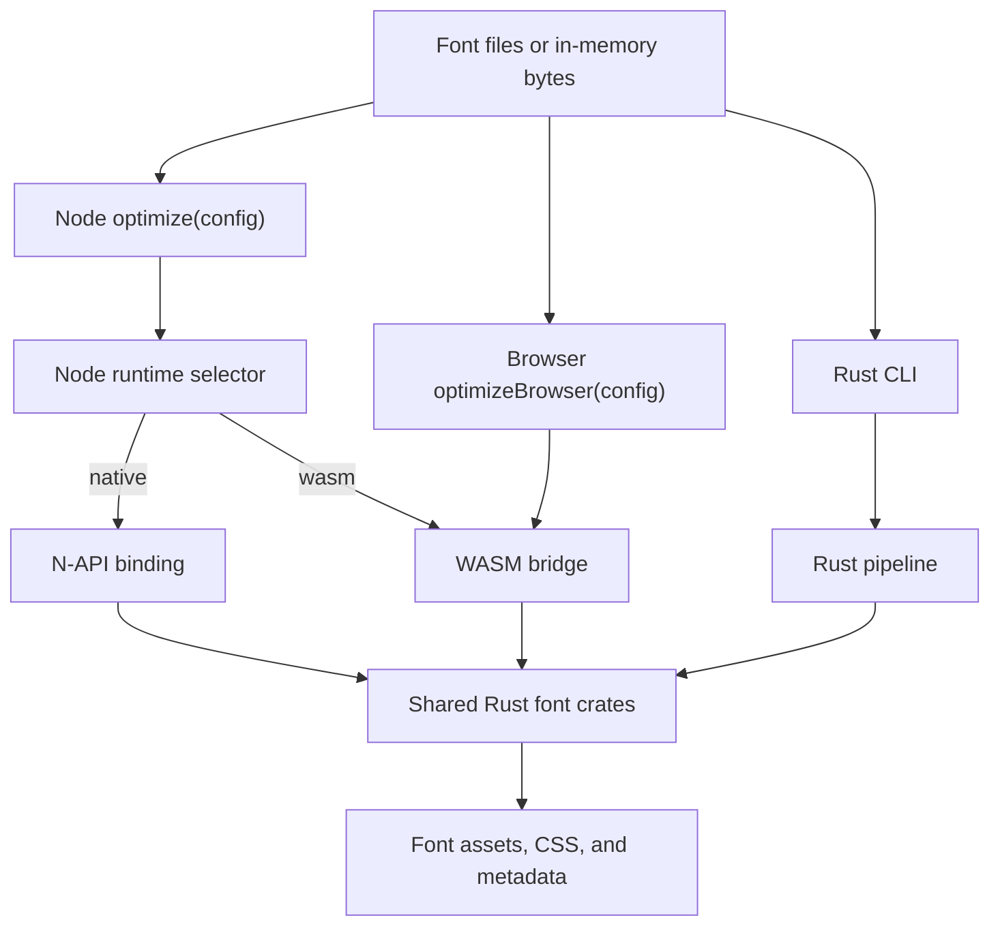

# Architecture

fontmin-rs is a Rust workspace with three public surfaces: a Rust CLI, a Node.js
package, and a browser WASM package. Font parsing, subsetting, conversion, and
CSS generation live in shared Rust crates; the JavaScript packages provide
typed runtime selection, plugin orchestration, and platform-specific I/O.

## Directory Structure

| Path                                                 | Responsibility                                                         |
| ---------------------------------------------------- | ---------------------------------------------------------------------- |
| `crates/fontmin`                                     | Public Rust facade for direct transforms and shared types              |
| `crates/fontmin_{core,detect,ttf}`                   | Assets, formats, metadata, format detection, and sfnt/TTF primitives   |
| `crates/fontmin_{subset,otf,woff,woff2,eot,svg,css}` | Subsetting, format conversion, icon fonts, and CSS generation          |
| `crates/fontmin_{config,fs,pipeline,plugin,plugins}` | Serializable config, path expansion, pipeline engine, and built-ins    |
| `crates/fontmin_{diagnostics,testing}`               | Shared errors, test fixtures, and fixture constructors                 |
| `apps/fontmin`                                       | Rust `fontmin-rs` CLI                                                  |
| `napi/fontmin`                                       | N-API bridge published as `@fontmin-rs/binding`                        |
| `packages/fontmin`                                   | Public `fontmin-rs` Node.js package, config loader, plugins, and cache |
| `wasm/fontmin-core`                                  | `wasm-bindgen` bridge that compiles the Rust facade to WebAssembly     |
| `wasm/fontmin`                                       | Public `@fontmin-rs/wasm` browser package and in-memory pipeline       |
| `npm/*`                                              | Platform-specific native binding packages                              |
| `fixtures`                                           | Fixed TTF and OTF inputs shared by Rust, Node.js, WASM, and docs tests |
| `docs`                                               | Bilingual VitePress site and browser playground                        |
| `scripts`                                            | Release metadata, package smoke, and artifact checks                   |

## Runtime Data Flow

```mermaid
flowchart TD
  files["Font files or in-memory bytes"]
  cli["Rust CLI"]
  node["Node optimize(config)"]
  browser["Browser optimizeBrowser(config)"]
  selector["Node runtime selector"]
  napi["N-API binding"]
  wasm["WASM bridge"]
  pipeline["Rust pipeline"]
  core["Shared Rust font crates"]
  outputs["Font assets, CSS, and metadata"]

  files --> cli --> pipeline
  files --> node --> selector
  selector -->|native| napi
  selector -->|wasm| wasm
  files --> browser --> wasm
  napi --> core
  wasm --> core
  pipeline --> core
  core --> outputs
```

The CLI runs the Rust pipeline directly. The Node package performs path and
glob expansion, cache access, output writes, and custom JavaScript hooks in
Node.js, while one selected runtime handles every built-in font operation. The
browser package has no filesystem layer and sends named in-memory assets
through the WASM bridge.

The public Node `optimize.ts` module is a thin facade. `optimize-pipeline.ts`
owns execution and lifecycle orchestration, `optimize-transforms.ts` owns
built-in transforms and output rules, `optimize-storage.ts` owns cache
persistence, and `workspace-io.ts` owns input expansion, text-file resolution,
guarded cleanup, and safe filesystem writes. Runtime-independent transform,
delivery-slice, missing-glyph, and diagnostic semantics live under
`runtime-neutral/` and are shared with the browser pipeline.

Integration tests follow the same public seams. Node suites under
`packages/fontmin/tests` separate direct font APIs, packaged CLI behavior,
optimizer behavior, configuration/plugins, and presets/cache. The Rust CLI
entry at `apps/fontmin/tests/cli.rs` delegates command-specific coverage to
modules under `apps/fontmin/tests/cli`.

Inside the Rust pipeline, `AssetMeta` uses typed fields for metadata consumed
by built-in plugins: icon Unicode assignments, CSS glyph records, and CSS
Unicode ranges. Its `custom` map remains available for third-party plugin
extensions and is not used as an untyped transport between built-ins.

## Internal Interface Map

| Interface                                   | Owns                                                                     | Does not own                       |
| ------------------------------------------- | ------------------------------------------------------------------------ | ---------------------------------- |
| `packages/fontmin/src/workspace-io.ts`      | Node paths, globs, text files, guarded cleanup, output writes            | Cache encoding or transform policy |
| `packages/fontmin/src/runtime-neutral/`     | Node/WASM transform semantics and diagnostic normalization               | Filesystem or runtime loading      |
| `apps/fontmin/src/commands/build/cache.rs`  | Cache keys, manifests, locking, atomic persistence                       | Final output writes                |
| `apps/fontmin/src/commands/build/output.rs` | Output containment, duplicate detection, symlink checks, guarded cleanup | Pipeline configuration             |
| `crates/fontmin_ttf/src/sfnt.rs`            | sfnt signatures, directories, ordering, alignment, checksums             | Format-specific table construction |
| `crates/fontmin_svg/src/icon/`              | Markup extraction, path geometry, and icon TTF tables                    | Public API orchestration           |
| `scripts/native-release-layout.mjs`         | N-API target-to-package and artifact layout                              | CI runner selection                |

`apps/fontmin/src/commands/build.rs`,
`crates/fontmin_svg/src/icon.rs`, and the public JavaScript entry points are
facades over these deeper modules. CLI integration tests use
`apps/fontmin/tests/cli/support.rs` for process and temporary-workspace setup so
individual suites describe command behavior rather than harness mechanics.

The ownership rules and their trade-offs are recorded in
[ADR 0001](./decisions/0001-canonical-internal-boundaries). Maintainer-facing
`CONTEXT.md` files next to the affected modules describe where future changes
belong.

## Package and Runtime Boundaries

The N-API and WASM bridges expose the same direct operations: subsetting,
TTC/OTC face inspection and extraction, TTF/WOFF/WOFF2/EOT/SVG conversion,
CFF/CFF2 OTF conversion, inspection, and CSS generation. Platform packages
under `npm/*` contain native binaries; they are
optional dependencies of `fontmin-rs`, so `runtime: 'auto'` can recover from a
missing native artifact by loading the packaged WASM module.

The N-API `targets` array is the canonical native inventory.
`scripts/native-release-layout.mjs` derives package directories, package names,
artifact names, and OS/CPU/libc constraints from it. Release checks also compare
the CI and release matrices with that inventory, so adding a target cannot
silently update only one publishing surface.

One `optimize()` call never mixes native and WASM built-ins. `native` is the
default, `wasm` forces WebAssembly, and `auto` falls back only when the native
binding cannot load. Invalid fonts, unsupported options, and conversion errors
do not trigger a second attempt in another runtime. Custom Node plugins remain
in Node.js regardless of the selected runtime.

`@fontmin-rs/wasm` is asynchronous and memory-only. It supports direct helpers,
the `optimizeBrowser()` pipeline, built-in conversion plugins, Unicode delivery
slices, presets, and custom asset transforms, but it has no path inputs, glob
expansion, disk cache, output directory, or filesystem hooks.

## Configuration Boundary

The Rust CLI and Node package share this automatic discovery order:

1. `fontmin.config.ts`
2. `fontmin.config.mts`
3. `fontmin.config.mjs`
4. `fontmin.config.cjs`
5. `fontmin.config.json`
6. `fontmin.config.jsonc`

The Rust CLI parses JSON and JSONC directly in Rust. It evaluates executable
module configs in a short-lived Node.js 22.18+ child process, then deserializes
the result and runs the Rust pipeline. Module configs are trusted project code:
they are not sandboxed and inherit the current environment and working
directory.

The module bridge accepts a default or named `config` export containing an
object, or a synchronous or asynchronous function returning one. It accepts
JSON-compatible data and serializable descriptors from built-in plugins,
`modernWeb()`, and `fontminCompatPreset()`. Custom JavaScript hooks,
function-valued `css.fontFamily`, unknown built-ins, and unsupported built-in
options are rejected with a field path such as `plugins[1].transform`.
Known built-in names and options are deserialized into typed
`fontmin_config` variants before `fontmin_pipeline` constructs the runtime
plugins; the pipeline does not decode raw plugin JSON.

After either loader reads a config file, an omitted `cwd` defaults to that
file's directory. Relative inputs, output and cache directories, and configured
`textFile` paths therefore resolve from the config directory. The Rust CLI
then applies command-line overrides. The Rust and Node schemas have a shared
baseline but also runtime-specific fields; the [configuration guide](./guide/config#configuration-models)
lists those differences explicitly.

## Rust Distribution Policy

All Rust workspace packages are internal implementation units and inherit
`publish = false` from `[workspace.package]`. The supported release artifacts
are the npm packages and GitHub Release assets; the Rust crates are not
published independently to crates.io. This keeps path-only internal
dependencies and the shared workspace version from implying a crates.io
compatibility contract. Any future public Rust crate requires an explicit
policy change, independently versioned dependency requirements, crate-specific
metadata, and a dedicated release gate.

## Current Boundaries

- OTF inspection supports static CFF, CFF2, and glyf-backed OpenType inputs.
  OTF-to-TTF conversion emits a static TrueType `glyf` font and removes CFF2
  and variation tables; Type 2 hinting is not retained.
- WOFF2 inspection validates the header and table directory before reading
  sfnt metadata. WOFF2-to-TTF decoding is available through both bridge APIs,
  while the synchronous Node helper remains native-only.
- `modernWeb()` emits WOFF, WOFF2, and CSS. EOT and SVG require explicit
  plugins, the compatibility preset, or matching CLI output formats.
- Rust CLI module configs can use serializable built-in descriptors, but they
  cannot execute arbitrary JavaScript plugin hooks inside the Rust pipeline.
