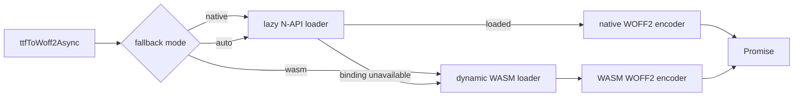

# Node Async WASM Fallback Design

## Goal

Let Node callers encode WOFF2 without a usable native binding by adding an
explicit asynchronous WASM fallback, while preserving every existing
synchronous native API and pipeline contract.

## Scope

The public Node package gains:

```ts
export async function ttfToWoff2Async(
  input: Uint8Array,
  options?: Ttf2Woff2Options,
): Promise<Buffer>
```

`ttfToWoff2Async()` accepts the existing `fallback` values:

- `native`: load the N-API binding and run the existing native encoder.
- `wasm`: load `@fontmin-rs/wasm` dynamically, initialize it from its packaged
  `.wasm` asset, then run its WOFF2 encoder.
- `auto` or omitted: attempt native first; retry with WASM only when loading
  the native binding fails.
- `js`: reject with an explicit unavailable-fallback error. No JavaScript
  encoder is introduced.

The synchronous `ttfToWoff2()` remains native-only. It continues to accept
`native` and `auto`; passing `wasm` explains that callers must use
`ttfToWoff2Async()`. The file-based `optimize()` pipeline remains synchronous
and native-only in this change.

## Architecture

`packages/fontmin/src/native.ts` no longer statically imports
`@fontmin-rs/binding`. A focused internal native-loader module uses
`createRequire()` and memoizes a successful binding lookup. Therefore merely
importing `fontmin-rs` succeeds on a platform without a native artifact; each
existing synchronous helper still attempts the native load at call time.

A focused internal WASM loader dynamically imports `@fontmin-rs/wasm`, resolves
that package's entry with `createRequire()`, reads its adjacent
`fontmin_wasm_core_bg.wasm`, and calls `initWasm(bytes)` exactly once. The main
package lists `@fontmin-rs/wasm` as a dependency so this asset is available in
a normal Node installation, but neither its JavaScript nor WASM is loaded on
the native path.



## Error Handling

- Only a failed native *binding load* triggers `auto` fallback. Invalid font
  data and native encoder errors are returned unchanged and never hidden by a
  WASM retry.
- `native` reports the binding-load failure directly.
- `wasm` reports an error prefixed with `WOFF2 WASM fallback failed` when its
  package, asset, initialization, or transform fails.
- `js` remains unsupported in both synchronous and asynchronous APIs.

## Compatibility and Packaging

- Existing named exports, default compatibility class, and plugin behavior
  remain synchronous and native-first.
- The root package import must not eagerly load `@fontmin-rs/binding`.
- `@fontmin-rs/wasm` remains an asynchronous runtime; this feature adapts it
  for Node initialization without changing its browser API.
- No package version, release workflow, publication command, or registry
  configuration changes are in scope.

## Verification

- Native WOFF2 behavior remains covered by existing package tests.
- New unit tests prove explicit WASM output begins with `wOF2`, can be decoded
  through the existing public API, and requires no caller-side WASM setup.
- Tests prove the synchronous API still rejects `wasm` and the async API still
  rejects `js`.
- Package typecheck, package tests, the WASM package tests, and the repository
  non-publishing check continue to pass.
