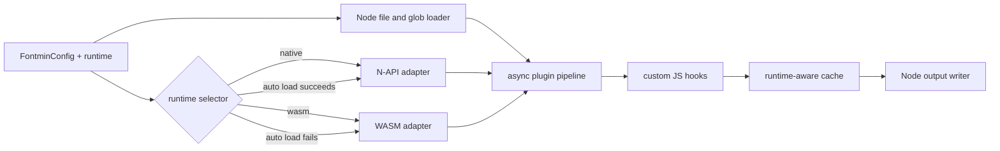

# Node File Optimize Runtime Design

## Goal

Allow the Node file-based `optimize()` pipeline to run every supported built-in
font operation through either the native binding or the packaged WASM runtime,
while keeping Node-specific file I/O, globbing, caching, output writing, and
custom JavaScript hooks in the Node package.

## Public API

`FontminConfig` gains a pipeline-wide runtime selector:

```ts
export type RuntimeMode = 'native' | 'wasm' | 'auto'

export interface FontminConfig {
  runtime?: RuntimeMode
  // Existing fields remain unchanged.
}
```

The default remains `native`. Existing callers therefore keep the same native
binding requirement and failure behavior unless they opt into another mode.

- `native` lazily loads the N-API binding and runs every built-in operation
  through it.
- `wasm` lazily initializes `@fontmin-rs/wasm` and runs every supported
  built-in operation through that runtime.
- `auto` attempts to load the native binding once. A
  `NativeBindingLoadError` selects WASM for the entire pipeline. A successful
  native load selects native for the entire pipeline.

The selection is stable for one `optimize()` call. A pipeline never mixes
native and WASM built-ins merely because a later operation fails.

## Runtime Boundary

The Node layer continues to own:

- path inputs and `Uint8Array` inputs;
- glob expansion;
- text-file loading;
- cache reads and writes;
- output-directory cleaning and asset writes;
- custom plugin lifecycle hooks;
- custom plugin transforms and emitted assets.

An internal asynchronous runtime adapter owns built-in operations:

```ts
interface OptimizeRuntime {
  readonly kind: 'native' | 'wasm'
  generateFontFaceCss(
    sources: CssFontSource[],
    options: CssOptions,
  ): Promise<string>
  inspect(input: Uint8Array): Promise<FontInfo>
  otfToTtf(input: Uint8Array, options: Otf2TtfOptions): Promise<Uint8Array>
  subsetTtf(input: Uint8Array, options: SubsetOptions): Promise<Uint8Array>
  svgFontToTtf(input: string, options: Svg2TtfOptions): Promise<Uint8Array>
  svgsToTtf(inputs: SvgIcon[], options: Svgs2TtfOptions): Promise<Uint8Array>
  ttfToEot(input: Uint8Array, options: Ttf2EotOptions): Promise<Uint8Array>
  ttfToSvg(input: Uint8Array, options: Ttf2SvgOptions): Promise<string>
  ttfToWoff(input: Uint8Array, options: WoffOptions): Promise<Uint8Array>
  ttfToWoff2(input: Uint8Array, options: Ttf2Woff2Options): Promise<Uint8Array>
}
```

Native synchronous helpers remain public and unchanged. The native adapter
wraps their results in promises; the WASM adapter maps to the existing
asynchronous `@fontmin-rs/wasm` API. This design does not add asynchronous
variants of every public direct helper.

## Pipeline Data Flow

`optimize()` resolves configuration and plugins, creates one runtime selector,
and passes it through every built-in transform. Custom JavaScript plugins run
in their existing positions around those built-ins.



Built-in transforms that currently use `flatMap()` become asynchronous loops
so conversion order and asset order remain deterministic. CSS generation also
uses the selected runtime for metadata inspection and CSS emission. A
function-valued `fontFamily` is evaluated in Node after asynchronous inspect;
the resolved string is passed to the selected runtime.

## Runtime Selection and Caching

The runtime selector memoizes its resolved adapter per `optimize()` call.
Explicit `native` and `wasm` initialize only when the first built-in operation
needs them. `auto` catches only `NativeBindingLoadError`; invalid font data,
unsupported options, and encoder errors propagate unchanged.

Cache identity includes both the requested runtime mode and the resolved
runtime kind. When caching is enabled, runtime selection happens before the
cache key is finalized. Consequently an `auto` pipeline backed by native never
shares an entry with an `auto` pipeline backed by WASM. The cache manifest
records the same requested/resolved pair and cache reads require it to match.

## Existing WOFF2 Fallback Compatibility

`Ttf2Woff2Options.fallback` remains supported for direct helpers and existing
plugin configurations.

- If `FontminConfig.runtime` is omitted, a `ttf2woff2` plugin's `fallback`
  becomes the legacy source for the pipeline-wide runtime mode. This keeps one
  runtime per pipeline while making existing `fallback: 'wasm'` and
  `fallback: 'auto'` configurations usable. Multiple WOFF2 plugins with
  conflicting fallback values produce a configuration error.
- If `FontminConfig.runtime` is explicit, it is authoritative for every
  built-in operation, including WOFF2. `runtime: 'native'` accepts only an
  omitted or `native` plugin fallback; `runtime: 'wasm'` accepts only an
  omitted or `wasm` plugin fallback; and `runtime: 'auto'` accepts only an
  omitted or `auto` plugin fallback. Every other pairing is a configuration
  error instead of a silent override.
- `fallback: 'js'` always produces the existing unavailable-fallback error.

This compatibility rule preserves old configurations while making new
pipeline-wide intent explicit.

## Unsupported Options and Errors

The WASM adapter validates options before invoking the runtime. If the WASM API
cannot represent an option supported by native, `runtime: 'wasm'` and an
auto-selected WASM runtime fail with an error naming the operation and option.
No option is silently dropped.

WASM package resolution, binary loading, initialization, and transform errors
retain their original cause and are wrapped with an operation-specific
`fontmin-rs WASM runtime failed` message. Native conversion errors remain
unchanged. Custom plugin errors keep their existing behavior.

## Packaging and Compatibility

- `@fontmin-rs/wasm` remains a regular dependency and is dynamically imported.
- Importing `fontmin-rs` does not initialize native or WASM code.
- The direct synchronous API, compatibility chain, CLI commands, package
  versions, and release workflow remain unchanged.
- `optimize()` keeps its existing name and `Promise<FontAsset[]>` return type.
- Browser consumers continue to use `optimizeBrowser()`; the Node file API is
  not added to the browser package.

## Verification

Tests must prove:

1. `runtime: 'wasm'` runs a complete file-based `modernWeb()` pipeline without
   caller-side WASM initialization and writes valid WOFF, WOFF2, and CSS.
2. `runtime: 'auto'` succeeds from an isolated package installation without a
   native platform artifact and uses WASM for all built-ins.
3. A native binding-load failure triggers auto fallback, while invalid font
   data and native encoder errors do not.
4. One `optimize()` call resolves one runtime and does not mix adapters.
5. A custom JavaScript plugin can run before or after WASM built-ins and emit
   assets through the existing context.
6. Runtime-specific cache entries do not collide.
7. Existing native pipelines and `ttfToWoff2Async()` behavior remain green.
8. Conflicting pipeline and plugin fallback settings fail clearly.

No package publication or version change is part of this work.
