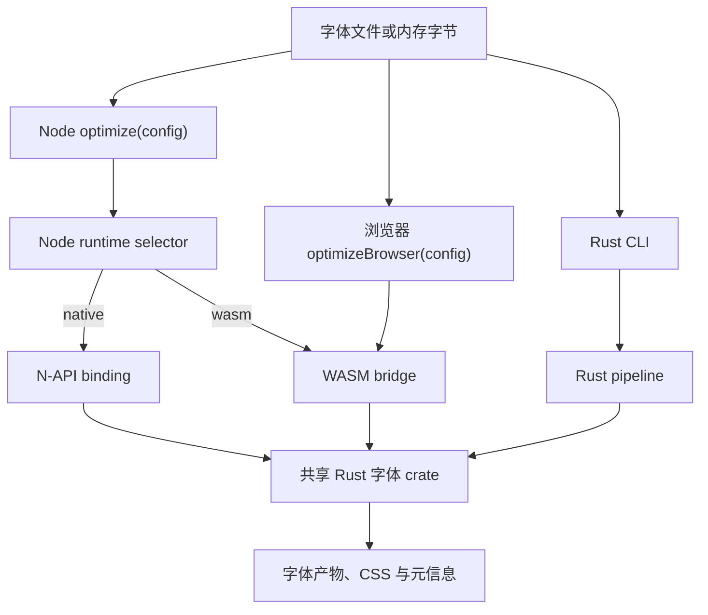

# 项目架构

fontmin-rs 是一个提供三种公开入口的 Rust workspace：Rust CLI、Node.js 包和浏览器
WASM 包。字体解析、子集化、格式转换与 CSS 生成位于共享 Rust crate 中；JavaScript
包负责类型化的 runtime 选择、plugin 编排以及平台相关 I/O。

## 目录结构

| 路径                                                 | 职责                                                       |
| ---------------------------------------------------- | ---------------------------------------------------------- |
| `crates/fontmin`                                     | 直接转换 API 与共享类型的 Rust facade                      |
| `crates/fontmin_{core,detect,ttf}`                   | 资产、格式、元信息、格式检测和 sfnt/TTF 基础能力           |
| `crates/fontmin_{subset,otf,woff,woff2,eot,svg,css}` | 子集化、格式转换、图标字体与 CSS 生成                      |
| `crates/fontmin_{config,fs,pipeline,plugin,plugins}` | 可序列化配置、路径展开、pipeline engine 与内置 plugin      |
| `crates/fontmin_{diagnostics,testing}`               | 共享错误、测试字体与 fixture 构造函数                      |
| `apps/fontmin`                                       | Rust `fontmin-rs` CLI                                      |
| `napi/fontmin`                                       | 发布为 `@fontmin-rs/binding` 的 N-API bridge               |
| `packages/fontmin`                                   | `fontmin-rs` Node.js 包、配置加载器、plugin 与缓存         |
| `wasm/fontmin-core`                                  | 将 Rust facade 编译为 WebAssembly 的 `wasm-bindgen` bridge |
| `wasm/fontmin`                                       | `@fontmin-rs/wasm` 浏览器包与纯内存 pipeline               |
| `npm/*`                                              | 各平台 native binding 包                                   |
| `fixtures`                                           | Rust、Node.js、WASM 与文档测试共享的固定 TTF/OTF 输入      |
| `docs`                                               | 双语 VitePress 站点与浏览器 Playground                     |
| `scripts`                                            | 发布元数据、包 smoke test 与产物检查                       |

## Runtime 数据流

CLI 直接运行 Rust pipeline。Node 包在 Node.js 中完成路径与 glob 展开、缓存访问、
产物写入和自定义 JavaScript hook，再由一次选定的 runtime 执行全部内置字体操作。
浏览器包没有文件系统层，具名内存资产会直接进入 WASM bridge。

## 包与 Runtime 边界

N-API 和 WASM bridge 暴露相同的直接操作：字体子集化、TTF/WOFF/WOFF2/EOT/SVG
转换、CFF/CFF2 OTF 转换、元信息检查和 CSS 生成。`npm/*` 下的平台包包含 native
binary，并作为 `fontmin-rs` 的 optional dependency 发布；因此 `runtime: 'auto'`
可以在 native artifact 缺失时加载随包发布的 WASM module。

一次 `optimize()` 调用不会混用 native 与 WASM 内置操作。默认值 `native` 使用
binding，`wasm` 强制使用 WebAssembly，`auto` 只在 native binding 无法加载时回退。
无效字体、不支持的选项或转换错误不会触发另一个 runtime 的二次尝试。无论选择何种
runtime，自定义 Node plugin 都仍在 Node.js 中运行。

`@fontmin-rs/wasm` 是异步、纯内存 API。它支持直接 helper、`optimizeBrowser()`、
内置转换 plugin、Unicode 分片、preset 和自定义资产 transform，但不支持路径输入、
glob、磁盘缓存、输出目录或文件系统 hook。

## 配置边界

Rust CLI 与 Node 包使用相同的自动发现顺序：

1. `fontmin.config.ts`
2. `fontmin.config.mts`
3. `fontmin.config.mjs`
4. `fontmin.config.cjs`
5. `fontmin.config.json`
6. `fontmin.config.jsonc`

Rust CLI 直接在 Rust 中解析 JSON 和 JSONC。可执行 module config 会由短生命周期的
Node.js 22+ 子进程求值，随后把结果反序列化并运行 Rust pipeline。Module config
属于受信任的项目代码：它不会被 sandbox，并会继承当前环境和工作目录。

Module bridge 接受默认导出或名为 `config` 的具名导出；导出值可以是对象，也可以是
返回对象的同步或异步函数。它接受 JSON-compatible 数据，以及内置 plugin、
`modernWeb()` 和 `fontminCompatPreset()` 产生的可序列化 descriptor。自定义
JavaScript hook、函数类型的 `css.fontFamily`、未知内置项和不受支持的内置选项会被
拒绝，错误会包含 `plugins[1].transform` 这样的字段路径。

任一加载器读取配置文件后，未设置的 `cwd` 都会默认为配置文件目录。因此相对输入、
输出与缓存目录以及配置中的 `textFile` 都从配置目录解析；Rust CLI 随后再应用命令行
override。Rust 与 Node schema 共享基础字段，但也包含 runtime 专属字段；
[配置指南](./guide/config#配置模型)列出了这些差异。

## 当前边界

- OTF 检查支持静态 CFF、CFF2 与 glyf-backed OpenType 输入。OTF-to-TTF 会生成静态
  TrueType `glyf` 字体并移除 CFF2 与 variation 表；Type 2 hinting 不会保留。
- WOFF2 检查会先校验 header 与 table directory，再读取 sfnt 元信息。两个 bridge API
  都支持 WOFF2-to-TTF；同步 Node helper 仍只使用 native。
- `modernWeb()` 输出 WOFF、WOFF2 和 CSS。EOT 与 SVG 需要显式 plugin、兼容 preset
  或对应的 CLI 输出格式。
- Rust CLI module config 可以使用可序列化的内置 descriptor，但不能在 Rust pipeline
  内执行任意 JavaScript plugin hook。
