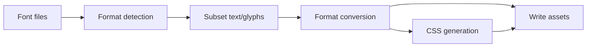

# 项目架构

fontmin-rs 是一个 Rust workspace 加 Node.js packaging 的混合项目。目标是把字体解析、子集化、转换等高成本逻辑放在 Rust 中，同时为前端生态提供 npm 包和 TypeScript 类型。

## 目录结构

| 路径                      | 说明                                       |
| ------------------------- | ------------------------------------------ |
| `crates/fontmin_core`     | 字体资产、格式、元信息和文本处理等基础模型 |
| `crates/fontmin_subset`   | TTF 子集化逻辑                             |
| `crates/fontmin_woff`     | WOFF 编码和解码                            |
| `crates/fontmin_woff2`    | WOFF2 编码、校验和 metadata inspection     |
| `crates/fontmin_eot`      | EOT 编码和解码                             |
| `crates/fontmin_svg`      | SVG font 与 SVG iconfont 转换              |
| `crates/fontmin_config`   | 共享的可序列化配置模型                     |
| `crates/fontmin_fs`       | 共享的路径解析和 glob 展开等文件系统工具   |
| `crates/fontmin_pipeline` | Rust pipeline engine                       |
| `crates/fontmin_testing`  | 共享的 Rust 测试 fixture 和构造函数        |
| `apps/fontmin`            | Rust CLI 应用                              |
| `napi/fontmin`            | N-API native binding                       |
| `packages/fontmin`        | 发布到 npm 的 TypeScript 包                |
| `npm/*`                   | 平台相关 native binding package manifest   |
| `fixtures`                | 测试字体和固定输入                         |
| `docs`                    | VitePress 文档站点                         |

## 数据流

CLI、Node API 和测试都会围绕同一组 fixture 验证行为。TypeScript package 中的 `optimize(config)` 会把输入文件加载为资产，按插件顺序执行 transform，再统一写入 `outDir`。

## 包边界

Rust crate 保持聚焦：格式检测、文件展开、子集化、转换、诊断和 pipeline 分别放在独立 crate 中。共享测试 fixture 放在仅作为 dev-dependency 使用的 `fontmin_testing` 中。这样 CLI、N-API binding 和未来 wasm fallback 都可以复用同一批核心能力，同时保持测试数据一致。

TypeScript package 负责：

- 对外暴露类型。
- 为 Node API 加载配置文件。
- 展开输入文件。
- 编排插件。
- 管理缓存。
- 提供 Fontmin-compatible 迁移层。

## 配置边界

Rust CLI 与 Node package 使用相同的自动发现顺序：

1. `fontmin.config.ts`
2. `fontmin.config.mts`
3. `fontmin.config.mjs`
4. `fontmin.config.cjs`
5. `fontmin.config.json`
6. `fontmin.config.jsonc`

Rust CLI 直接在 Rust 中解析 JSON 和 JSONC，处理这些格式时绝不会启动
Node.js。可执行 module config 会由短生命周期的 Node.js 22+ 子进程求值，
再由 Rust CLI 反序列化结果并运行 pipeline。Module config 是受信任的项目
代码：CLI 不会对其进行 sandbox，并且它会继承当前环境和工作目录。

Module 边界接受默认导出或名为 `config` 的具名导出；导出值可以是对象，
也可以是返回对象的同步或异步函数。它接受 JSON-compatible 数据，以及
内置 plugin、`modernWeb()` 和 `fontminCompatPreset()` preset 生成的可序列化
descriptor。自定义 plugin 函数、函数类型的 `css.fontFamily`、未知内置项和
不支持的内置选项会被拒绝，错误中会包含 `plugins[1].transform` 或
`css.fontFamily` 这样的字段路径。

加载任意配置格式后，Rust 会在未设置 `cwd` 时将其默认为配置文件目录，
然后应用 CLI override。因此，除非显式设置 `cwd`，相对输入路径、输出和
缓存目录以及配置中的 `textFile` 都从配置文件目录解析。

## 当前限制

- OTF metadata inspection 已支持。`otf2ttf` 可以将静态 CFF OTF 以及 CFF2 默认/显式实例转换为静态 TrueType `glyf` 字体，也可以重写 glyf-backed OTF wrapper；输出会移除 CFF2 和 variation 表。
- WOFF2 inspect/validate 会校验 header 和 table directory、读取 sfnt metadata tables，并通过 native 路径支持 WOFF2 到 TTF decode。
- `modernWeb()` 只输出 WOFF、WOFF2 和 CSS；EOT、SVG 需要显式插件或 CLI formats。
