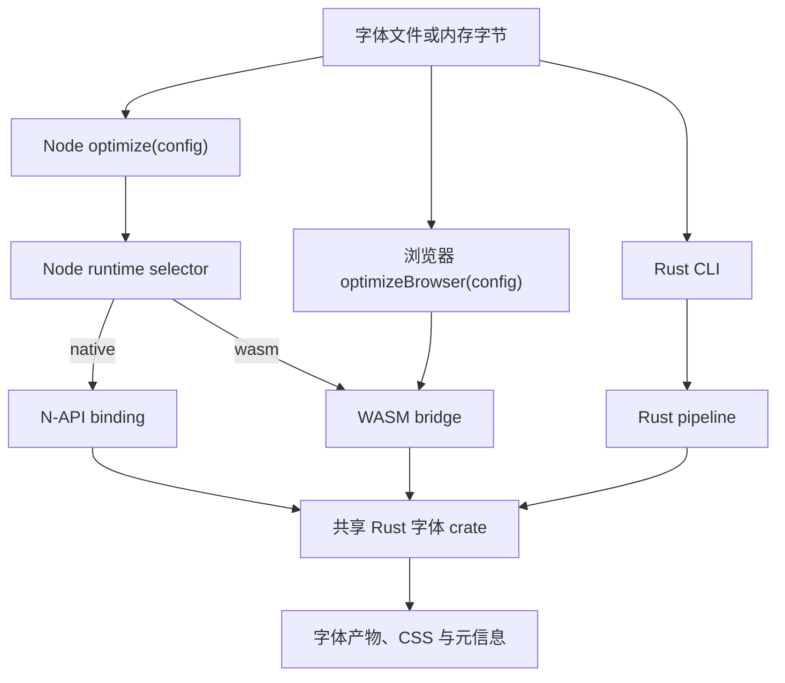

# 项目架构

fontmin-rs 是一个提供三种公开入口的 Rust workspace：Rust CLI、Node.js 包和浏览器
WASM 包。字体解析、子集化、格式转换与 CSS 生成位于共享 Rust crate 中；JavaScript
包负责类型化的 runtime 选择、plugin 编排以及平台相关 I/O。

## 目录结构

| 路径                                                 | 职责                                                       |
| ---------------------------------------------------- | ---------------------------------------------------------- |
| `crates/fontmin`                                     | 直接转换 API 与共享类型的 Rust facade                      |
| `crates/fontmin_{core,detect,ttf}`                   | 资产、格式、元信息、格式检测和 sfnt/TTF 基础能力           |
| `crates/fontmin_{subset,otf,woff,woff2,eot,svg,css}` | 子集化、格式转换、图标字体与 CSS 生成                      |
| `crates/fontmin_{config,fs,pipeline,plugin,plugins}` | 可序列化配置、路径展开、pipeline engine 与内置 plugin      |
| `crates/fontmin_{diagnostics,testing}`               | 共享错误、测试字体与 fixture 构造函数                      |
| `apps/fontmin`                                       | Rust `fontmin-rs` CLI                                      |
| `napi/fontmin`                                       | 发布为 `@fontmin-rs/binding` 的 N-API bridge               |
| `packages/fontmin`                                   | `fontmin-rs` Node.js 包、配置加载器、plugin 与缓存         |
| `wasm/fontmin-core`                                  | 将 Rust facade 编译为 WebAssembly 的 `wasm-bindgen` bridge |
| `wasm/fontmin`                                       | `@fontmin-rs/wasm` 浏览器包与纯内存 pipeline               |
| `npm/*`                                              | 各平台 native binding 包                                   |
| `fixtures`                                           | Rust、Node.js、WASM 与文档测试共享的固定 TTF/OTF 输入      |
| `docs`                                               | 双语 VitePress 站点与浏览器 Playground                     |
| `scripts`                                            | 发布元数据、包 smoke test 与产物检查                       |

## Runtime 数据流

```mermaid
flowchart TD
  files["字体文件或内存字节"]
  cli["Rust CLI"]
  node["Node optimize(config)"]
  browser["浏览器 optimizeBrowser(config)"]
  selector["Node runtime selector"]
  napi["N-API binding"]
  wasm["WASM bridge"]
  pipeline["Rust pipeline"]
  core["共享 Rust 字体 crate"]
  outputs["字体产物、CSS 与元信息"]

  files --> cli --> pipeline
  files --> node --> selector
  selector -->|native| napi
  selector -->|wasm| wasm
  files --> browser --> wasm
  napi --> core
  wasm --> core
  pipeline --> core
  core --> outputs
```

CLI 直接运行 Rust pipeline。Node 包在 Node.js 中完成路径与 glob 展开、缓存访问、
产物写入和自定义 JavaScript hook，再由一次选定的 runtime 执行全部内置字体操作。
浏览器包没有文件系统层，具名内存资产会直接进入 WASM bridge。

公开的 Node `optimize.ts` 模块只保留轻量 facade。`optimize-pipeline.ts` 负责执行与
lifecycle 编排，`optimize-transforms.ts` 负责内置 transform 和产物规则，
`optimize-storage.ts` 负责缓存持久化，`workspace-io.ts` 负责输入展开、text file
解析、受保护的清理与安全文件写入。与 runtime 无关的 transform、delivery slice、
missing glyph 和 diagnostic 语义位于 `runtime-neutral/`，并与浏览器 pipeline 共享。

Integration tests 同样沿公开 seam 组织。`packages/fontmin/tests` 下的 Node suites
分别覆盖直接字体 API、打包 CLI、optimizer、配置/plugin 以及 preset/cache；
Rust CLI 入口 `apps/fontmin/tests/cli.rs` 则把各命令的覆盖委托给
`apps/fontmin/tests/cli` 下的模块。

在 Rust pipeline 内，`AssetMeta` 为内置 plugin 消费的元信息提供类型化字段，包括
icon Unicode 指派、CSS glyph 记录和 CSS Unicode range。`custom` map 继续供第三方
plugin 扩展使用，不再作为内置 plugin 之间的无类型传输通道。

## 内部接口地图

| 接口                                        | 负责                                                 | 不负责                      |
| ------------------------------------------- | ---------------------------------------------------- | --------------------------- |
| `packages/fontmin/src/workspace-io.ts`      | Node 路径、glob、text file、受保护清理与输出写入     | 缓存编码或 transform policy |
| `packages/fontmin/src/runtime-neutral/`     | Node/WASM transform 语义与 diagnostic 规范化         | 文件系统或 runtime 加载     |
| `apps/fontmin/src/commands/build/cache.rs`  | 缓存 key、manifest、锁与原子持久化                   | 最终输出写入                |
| `apps/fontmin/src/commands/build/output.rs` | 输出 containment、重复检测、symlink 检查与受保护清理 | Pipeline 配置               |
| `crates/fontmin_ttf/src/sfnt.rs`            | sfnt signature、directory、排序、对齐与 checksum     | 格式专属 table 构造         |
| `crates/fontmin_svg/src/icon/`              | Markup 提取、path geometry 与 icon TTF table         | 公开 API 编排               |
| `scripts/native-release-layout.mjs`         | N-API target 到 package/artifact 的布局              | CI runner 选择              |

`apps/fontmin/src/commands/build.rs`、`crates/fontmin_svg/src/icon.rs` 与公开
JavaScript 入口是这些深模块之上的 facade。CLI integration test 通过
`apps/fontmin/tests/cli/support.rs` 统一进程和临时 workspace 设置，使各 suite
只描述 command 行为，不再重复 harness 机制。

这些 ownership 规则及其权衡记录在
[ADR 0001](./decisions/0001-canonical-internal-boundaries)。相关模块旁的
`CONTEXT.md` 则向维护者说明未来修改应落在哪一层。

## 包与 Runtime 边界

N-API 和 WASM bridge 暴露相同的直接操作：字体子集化、TTF/WOFF/WOFF2/EOT/SVG
转换、CFF/CFF2 OTF 转换、元信息检查和 CSS 生成。`npm/*` 下的平台包包含 native
binary，并作为 `fontmin-rs` 的 optional dependency 发布；因此 `runtime: 'auto'`
可以在 native artifact 缺失时加载随包发布的 WASM module。

N-API 的 `targets` 数组是 canonical native inventory。
`scripts/native-release-layout.mjs` 从中推导 package directory、package name、
artifact name 以及 OS/CPU/libc 约束。发布检查还会比较 CI 和 release matrix 与该
inventory，避免新增 target 时只更新某一个发布入口。

一次 `optimize()` 调用不会混用 native 与 WASM 内置操作。默认值 `native` 使用
binding，`wasm` 强制使用 WebAssembly，`auto` 只在 native binding 无法加载时回退。
无效字体、不支持的选项或转换错误不会触发另一个 runtime 的二次尝试。无论选择何种
runtime，自定义 Node plugin 都仍在 Node.js 中运行。

`@fontmin-rs/wasm` 是异步、纯内存 API。它支持直接 helper、`optimizeBrowser()`、
内置转换 plugin、Unicode 分片、preset 和自定义资产 transform，但不支持路径输入、
glob、磁盘缓存、输出目录或文件系统 hook。

## 配置边界

Rust CLI 与 Node 包使用相同的自动发现顺序：

1. `fontmin.config.ts`
2. `fontmin.config.mts`
3. `fontmin.config.mjs`
4. `fontmin.config.cjs`
5. `fontmin.config.json`
6. `fontmin.config.jsonc`

Rust CLI 直接在 Rust 中解析 JSON 和 JSONC。可执行 module config 会由短生命周期的
Node.js 22.18+ 子进程求值，随后把结果反序列化并运行 Rust pipeline。Module config
属于受信任的项目代码：它不会被 sandbox，并会继承当前环境和工作目录。

Module bridge 接受默认导出或名为 `config` 的具名导出；导出值可以是对象，也可以是
返回对象的同步或异步函数。它接受 JSON-compatible 数据，以及内置 plugin、
`modernWeb()` 和 `fontminCompatPreset()` 产生的可序列化 descriptor。自定义
JavaScript hook、函数类型的 `css.fontFamily`、未知内置项和不受支持的内置选项会被
拒绝，错误会包含 `plugins[1].transform` 这样的字段路径。
已知内置项的名称和选项会先反序列化为类型化的 `fontmin_config` variant，再由
`fontmin_pipeline` 构造运行时 plugin；pipeline 不再解码原始 plugin JSON。

任一加载器读取配置文件后，未设置的 `cwd` 都会默认为配置文件目录。因此相对输入、
输出与缓存目录以及配置中的 `textFile` 都从配置目录解析；Rust CLI 随后再应用命令行
override。Rust 与 Node schema 共享基础字段，但也包含 runtime 专属字段；
[配置指南](./guide/config#配置模型)列出了这些差异。

## Rust 分发策略

所有 Rust workspace package 都是内部实现单元，并从 `[workspace.package]` 继承
`publish = false`。受支持的发布产物是 npm packages 与 GitHub Release assets；
Rust crates 不会单独发布到 crates.io。这样可避免只有 path 的内部依赖和共享
workspace 版本被误解为 crates.io 兼容性契约。未来若要公开 Rust crate，必须显式
修改策略、为内部依赖增加独立版本要求、补齐 crate 专属 metadata，并增加专用发布
门禁。

## 当前边界

- OTF 检查支持静态 CFF、CFF2 与 glyf-backed OpenType 输入。OTF-to-TTF 会生成静态
  TrueType `glyf` 字体并移除 CFF2 与 variation 表；Type 2 hinting 不会保留。
- WOFF2 检查会先校验 header 与 table directory，再读取 sfnt 元信息。两个 bridge API
  都支持 WOFF2-to-TTF；同步 Node helper 仍只使用 native。
- `modernWeb()` 输出 WOFF、WOFF2 和 CSS。EOT 与 SVG 需要显式 plugin、兼容 preset
  或对应的 CLI 输出格式。
- Rust CLI module config 可以使用可序列化的内置 descriptor，但不能在 Rust pipeline
  内执行任意 JavaScript plugin hook。
